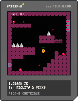

# blobson jr.
A simple platformer for the pico-8 fantasy console.

## the exercise
Some time ago, after picking up a bunch of tutorials and exploring a few things in pico-8, I tried to make a "base template" for practicing platformer level-design with some basic systems already set up. The player movement in particular is heavily inspired by, if not a complete reproduction of, the [nerdyteachers' platformer guide](https://nerdyteachers.com/explain/platformer/), with some customizations on top. Enemies, hazards, and the level system were then built out from there. This exercise is meant as a base for future level design practice.

## features
- **player movement** — acceleration/friction-based running, jumping, sliding to a stop, and separate falling/landing states, all with their own animations
- **blobs** — patrol enemies that walk until they hit a wall or ledge, then turn around; stomp them from above to kill them, or take damage/knockback if you touch them any other way
- **shooters** — stationary enemies that fire bullets in a fixed direction; bullets travel until they hit something solid or run out of range
- **spikes** — instant damage + knockback, with a short invincibility window after getting hit
- **flowers** — stepping on one advances you to the next level
- **levels** — laid out in a 4-wide grid on the shared map (so level 4 wraps to a new row), with helper functions handling the level → map-cell math
- **lives system** — 3 lives, temporary invincibility after taking a hit, restart prompt on death
- **camera** — basic camera system (currently mostly static; scrolling toggle is there for later)
- **debug mode** — "Z" toggles an overlay showing collision states, current level, and live entity counts
- **music & sfx** — background music plus sound effects for jumps, hits, stomps, and level transitions

## status
Core mechanics and the level-switching logic are in place. Only the first level currently has "real" map content built out — the rest of the grid is blank and still needs to be designed.

## credits
- miguel duarte (miglito) - design, code, art, sound
- vick falcão - design, art
